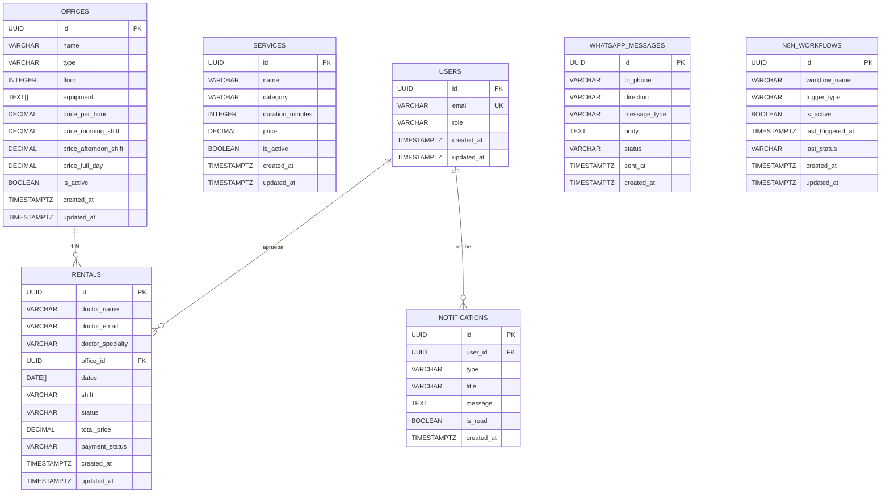
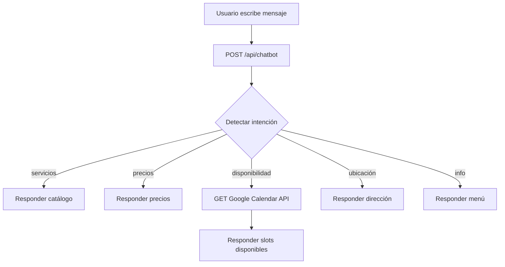
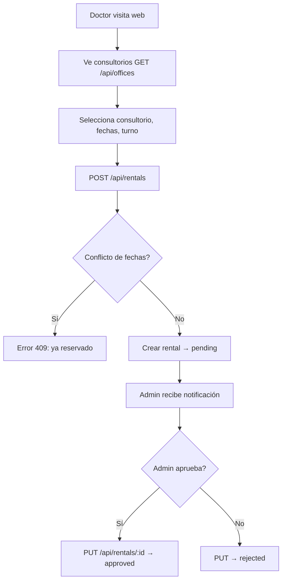
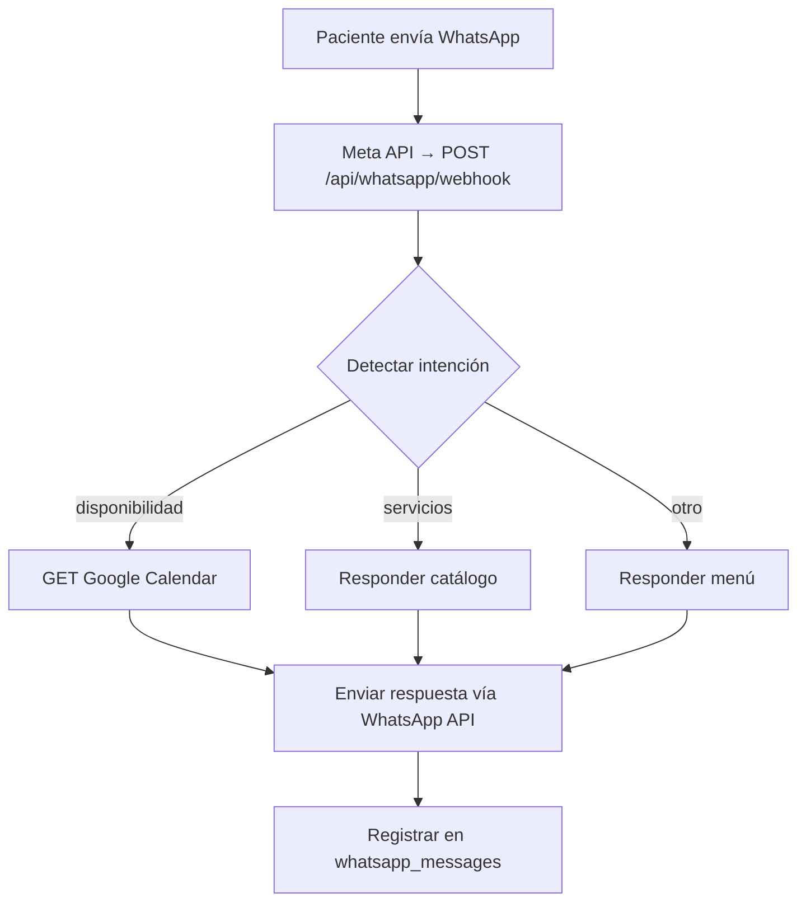

# Diagrama Entidad-Relación - ProDental Radiología

## Diagrama ER (Mermaid)



---

## Sistema externo: Google Calendar
```
┌──────────────────────────────┐
│      Google Calendar          │
│  (fuente de verdad - citas)   │
│                               │
│  API consumida por:           │
│  - /api/chatbot               │
│  - /api/whatsapp/webhook      │
│  - n8n (recordatorios, etc.)  │
└──────────────────────────────┘
```

---

## Diagrama de Flujo: Chatbot Web



## Diagrama de Flujo: Renta de Consultorio



## Diagrama de Flujo: WhatsApp



---

## Visualización con dbdiagram.io

```
Table users {
  id uuid [pk]
  email varchar [unique]
  role varchar
  created_at timestamp
  updated_at timestamp
}

Table services {
  id uuid [pk]
  name varchar
  description text
  category varchar
  duration_minutes int
  price decimal
  is_active boolean
  requires_xray boolean
  requires_followup boolean
  created_at timestamp
  updated_at timestamp
}

Table offices {
  id uuid [pk]
  name varchar
  type varchar
  floor int
  description text
  equipment text[]
  photo_url varchar
  photo_gallery varchar[]
  price_per_hour decimal
  price_morning_shift decimal
  price_afternoon_shift decimal
  price_full_day decimal
  is_active boolean
  created_at timestamp
  updated_at timestamp
}

Table rentals {
  id uuid [pk]
  doctor_name varchar
  doctor_email varchar
  doctor_specialty varchar
  office_id uuid [ref: > offices.id]
  dates date[]
  shift varchar
  status varchar
  total_price decimal
  payment_status varchar
  payment_method varchar
  payment_date timestamp
  notes text
  admin_notes text
  approved_by uuid [ref: > users.id]
  created_at timestamp
  updated_at timestamp
}

Table whatsapp_messages {
  id uuid [pk]
  to_phone varchar
  direction varchar
  message_type varchar
  template_name varchar
  body text
  status varchar
  whatsapp_id varchar
  error_message text
  sent_at timestamp
  created_at timestamp
}

Table n8n_workflows {
  id uuid [pk]
  workflow_name varchar
  description text
  trigger_type varchar
  webhook_url varchar
  is_active boolean
  last_triggered_at timestamp
  last_status varchar
  error_log text
  created_at timestamp
  updated_at timestamp
}

Table notifications {
  id uuid [pk]
  user_id uuid [ref: > users.id]
  type varchar
  title varchar
  message text
  is_read boolean
  created_at timestamp
}
```
